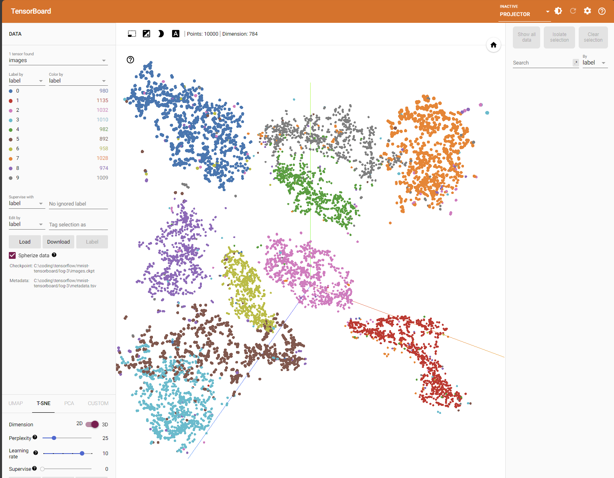
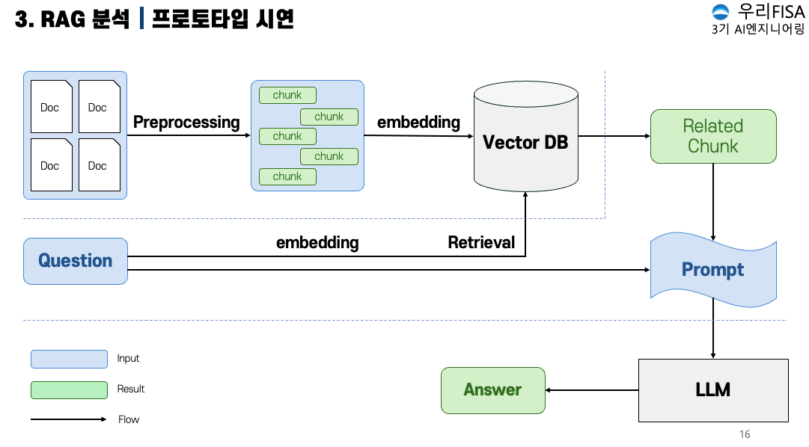
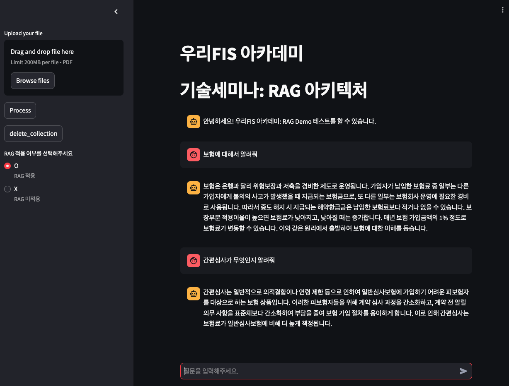

# 우리FIS 아카데미 3기 - 기술세미나: RAG 아키텍처
## **멤버**

<table>
 <tr>
    <td align="center"><a href="https://github.com/DoxB"></td>
    <td align="center"><a href="https://github.com/eunhyea"></td>
  </tr>
  <tr>
    <td align="center"><a href="https://github.com/DoxB"><b>임정규</b></td>
    <td align="center"><a href="https://github.com/JiyeonJeong02"><b>정지연</b></td>
  </tr>
  <tr>
    <td align="center">Python</td>
    <td align="center">Python</td>
  </tr>
</table>

 

## **구현 환경**
- CPU: i5-13600k
- RAM: 64GB
- GPU: RTX-4070TI
- LLM: llama3-8B-Q4 (한국어)
- Embedding: paraphrase multilingual mpnet base v2
- VectorDB: Qdrant

 

## **벡터 시각화**

 

## **데모 아키텍처**

 

## **데모 화면**
